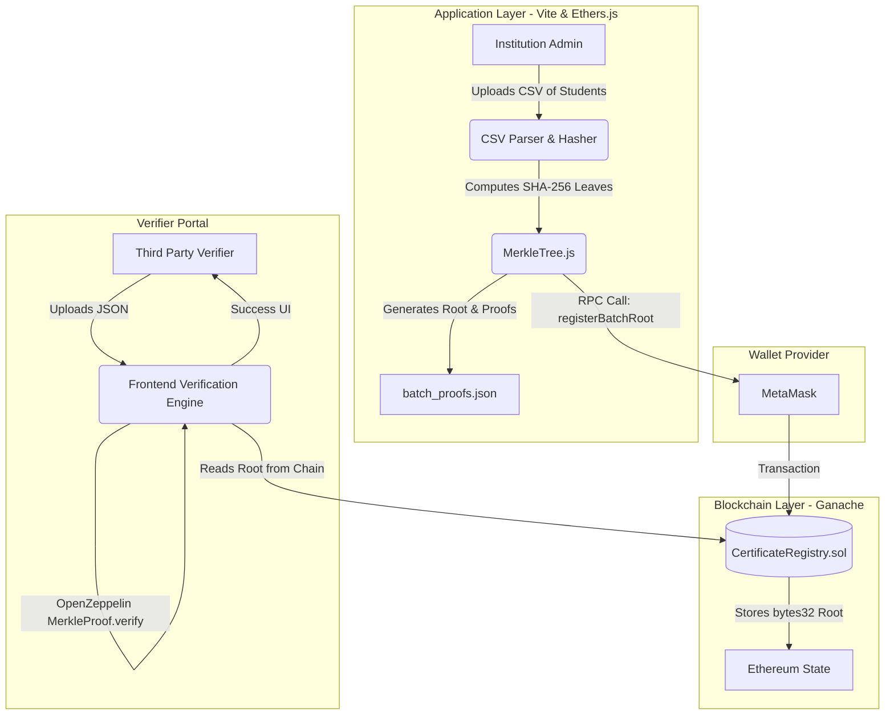

<div align="center">
  
  <h1>🎓 EduChain: The Architecture of Trust</h1>
  <p><strong>A Highly Optimized, Premium Blockchain Academic Credential Platform</strong></p>

  <p>
    <a href="https://github.com/Mihirmehta1357/BLCNSEM-7"></a>
    
    
    
    
  </p>
</div>

---

## 🌟 Introduction

Welcome to **EduChain**, a state-of-the-art decentralized application (dApp) designed to revolutionize the way academic institutions issue, manage, and verify credentials.

By replacing traditional, easily-forged paper and PDF certificates with **undeniable cryptographic truth**, EduChain ensures absolute data integrity. Instead of storing expensive metadata (like images) on the blockchain, EduChain operates purely on **cryptographic hashes** and **Merkle Trees**, bridging the gap between Web2 efficiency and Web3 trust.

---

## ✨ Core Features & Technical Highlights

- **🛡️ Cryptographic Integrity:** Combines `ID + Name + Course + Institution` into a single string and hashes it via `SHA-256` on the client side. The smart contract validates this against an on-chain record using `keccak256`.
- **🌳 Optimized Bulk Issuance (Merkle Trees):** Issue 10,000+ certificates for the *exact same gas cost* as issuing a single certificate by computing the Merkle Root off-chain and storing only the `bytes32` root on-chain.
- **🔗 Seamless Web3 Integration:** Native MetaMask connection handling. Automatically provisions and switches the user to the local Ganache network (Chain ID: 31337) if not found.
- **🎨 Premium UI/UX (Zero Frameworks):** A completely bespoke interface built with Vanilla CSS. Features dynamic glassmorphism, contextual depth (`box-shadow`), and an interactive SVG Merkle visualizer that renders live in the DOM.
- **🕵️ Automated Verifier Portal:** Third parties can verify individual hashes manually or upload a `batch_proofs.json` file for automated, mathematical proof-of-inclusion against the blockchain.

---

## 🏗️ System Architecture

The ecosystem is cleanly decoupled into two distinct layers to maximize security and performance.

### 1. The Blockchain Layer (Backend)
Built on the **Hardhat** framework, deployed locally to **Ganache** (`http://127.0.0.1:8545`). 
The single source of truth is the `CertificateRegistry.sol` contract (Solidity `^0.8.20`).

### 2. The Application Layer (Frontend)
A modern Single Page Application (SPA) built with **Vanilla JS, HTML, CSS, and Vite**. It utilizes `ethers.js` (v6) for RPC calls and the native Web Crypto API (`crypto.subtle`) combined with `merkletreejs` for heavy cryptographic lifting.



---

## 📜 Smart Contract Deep Dive: `CertificateRegistry.sol`

The smart contract acts as the immutable registry. It implements strict access control (`onlyAdmin`) to ensure only the deployer can issue or revoke credentials.

### Key State Variables
- `mapping(string => Certificate) private certificates;` - Stores individual certificate metadata.
- `mapping(string => bytes32) public batchRoots;` - Maps a unique `Batch ID` to its Cryptographic `Merkle Root`.

### Core Functions

| Function Name | Visibility | Purpose | Mechanism |
|--------------|-----------|---------|-----------|
| `issueCertificate()` | `public onlyAdmin` | Single Issuance | Maps the `ID` to the `Certificate` struct containing the `certificateHash`. Marks `valid = true`. |
| `revokeCertificate()` | `public onlyAdmin` | Revocation | Flips the `valid` boolean to `false`. Future verifications immediately fail. |
| `batchIssueCertificates()`| `public onlyAdmin` | Standard Bulk Issue | Loops through arrays of data to store multiple structs. **(High Gas Cost)** |
| `registerBatchRoot()` | `public onlyAdmin` | **Optimized Bulk Issue** | Takes a `_batchId` and a single `bytes32 _merkleRoot`. **(Extremely Low Gas Cost)** |
| `verifyCertificate()` | `public view` | Standard Verify | Hashes the provided `_hash` via `keccak256` and compares it to the stored hash. |
| `verifyMerkleCertificate()`| `public view` | **Merkle Verify** | Uses OpenZeppelin's `MerkleProof.verify` to check if a provided leaf and proof mathematically resolve to the on-chain Root. |

---

## ⛽ The Gas Optimization Masterclass

Why use Merkle Trees? Storing data on Ethereum is incredibly expensive.

If an institution wants to graduate 1,000 students:
1. **Standard `batchIssueCertificates`:** The contract loops 1,000 times, performing 1,000 `SSTORE` operations. This costs massive amounts of gas and may hit the block gas limit, causing the transaction to revert.
2. **Optimized `registerBatchRoot` (Merkle):** The frontend hashes all 1,000 students into a Merkle Tree and extracts ONE root hash. The contract performs exactly ONE `SSTORE` operation. 

**Cost comparison:**
- Standard Batch (1000 certs): ~`25,000,000 Gas`
- Merkle Root (1000 certs): ~`45,000 Gas` (A **99.8% reduction** in fees).

---

## 🚀 Local Development & Setup

Follow these exact steps to spin up the entire architecture on your local machine.

### Prerequisites
- [Node.js](https://nodejs.org/) (v16+)
- [Ganache](https://trufflesuite.com/ganache/) (Running on Port 8545)
- [MetaMask](https://metamask.io/) browser extension

### Step 1: Deploy the Smart Contract
Open a terminal and navigate to the backend directory:
```bash
cd backend
npm install
```
Compile and deploy the contract to your local Ganache network:
```bash
npx hardhat compile
npx hardhat run scripts/deploy.js --network localhost
```
*Note: Copy the resulting contract address. You may need to update it in `frontend/src/main.js` if it differs.*

### Step 2: Start the Frontend Application
Open a second terminal window and navigate to the frontend directory:
```bash
cd frontend
npm install
npm run dev
```
Navigate to `http://localhost:5173` in your browser. 

### Step 3: Configure MetaMask
1. Open MetaMask and click "Add Network".
2. Add Ganache manually:
   - **Network Name:** Local Ganache
   - **New RPC URL:** `http://127.0.0.1:8545`
   - **Chain ID:** `31337` (or `1337` depending on your Ganache settings)
   - **Currency Symbol:** `ETH`
3. Import the first private key from Ganache into MetaMask to act as the `Admin`.

---

## 📂 Project Directory Structure

```text
blockchain/
├── backend/
│   ├── contracts/
│   │   └── CertificateRegistry.sol  # Core Smart Contract
│   ├── scripts/
│   │   └── deploy.js                # Deployment Script
│   └── hardhat.config.js            # Hardhat Network Configuration
├── frontend/
│   ├── public/                      # Static Assets (Favicon, SVGs)
│   ├── src/
│   │   ├── main.js                  # DApp Logic, Ethers.js, Web Crypto API
│   │   └── style.css                # Premium Glassmorphism UI Styling
│   ├── index.html                   # Web Application Entry Point
│   └── vite.config.js               # Vite Bundler Configuration
└── README.md
```

---

## 🧪 Testing Instructions

To ensure the smart contract operates perfectly (covering single issuance, revocation, and cryptographic Merkle verification), you can run the Hardhat test suite:

```bash
cd backend
npx hardhat test
```

---

## 🗺️ Future Roadmap

- **IPFS Integration:** Store extended credential metadata (like heavy PDF transcripts) on the InterPlanetary File System.
- **Polygon / Arbitrum Deployment:** Migrate from the local Ganache network to a Layer-2 scaling solution for ultra-low gas fees on a live public mainnet.
- **Soulbound Tokens (SBTs):** Upgrade the architecture so certificates are minted as non-transferable NFTs, bound permanently to the student's wallet address.

---

## 🤝 Contributing Guidelines & License

### Contributing
Contributions are what make the open-source community such an amazing place to learn, inspire, and create. Any contributions you make are **greatly appreciated**.

1. Fork the Project
2. Create your Feature Branch (`git checkout -b feature/AmazingFeature`)
3. Commit your Changes (`git commit -m 'Add some AmazingFeature'`)
4. Push to the Branch (`git push origin feature/AmazingFeature`)
5. Open a Pull Request

### License
Distributed under the **MIT License**. See `LICENSE` for more information.

---

## 🎨 The User Experience

1. **Admin Console:** Provides a sleek interface for manual data entry or drag-and-drop CSV uploads. Generating a batch automatically triggers a download of `batch_proofs.json`.
2. **Student Portal:** Students enter their ID to generate a dynamic, beautifully styled UI Certificate. A QR code is rendered on the fly, embedding their ID and Hash for easy scanning.
3. **Verifier Portal:** Designed for absolute frictionless verification. Upload the `batch_proofs.json`, type the ID, and the engine handles the cryptographic proofs against the blockchain in milliseconds, displaying a "Spectacular Success" animation upon validation.

---

<div align="center">
  <br/>
  <p><i>Building the standard for cryptographic academic integrity.</i></p>
  <p><b>Created with ❤️ by Mihir Mehta & Team </b></p>
</div>
