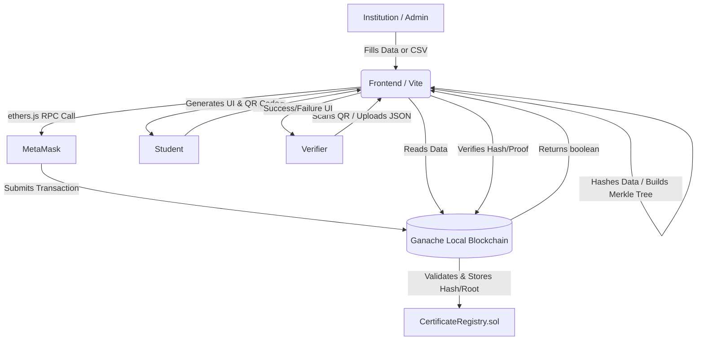

<div align="center">
  
  <h1>🎓 EduChain: The Architecture of Trust</h1>
  <p><strong>Premium, Blockchain-Based Academic Credential Platform</strong></p>

  <p>
    <a href="https://github.com/Mihirmehta1357/BLCNSEM-7"></a>
    
    
    
  </p>
</div>

---

## 🌟 Introduction

Welcome to **EduChain**! EduChain revolutionizes how academic credentials are issued, verified, and presented. By replacing easily forged paper and PDF certificates with **undeniable cryptographic truth**, EduChain ensures absolute data integrity using the Ethereum blockchain.

Instead of storing heavy data like images on-chain—which is prohibitively expensive—EduChain operates purely on **cryptographic hashes** and **Merkle Trees**. 

## ✨ Key Features

- **🛡️ Cryptographic Integrity:** Uses SHA-256 to hash credential data (ID, Name, Course, Institution) into a deterministic fingerprint.
- **⚡ Bulk Issuance via Merkle Trees:** Issue 1,000+ certificates for the exact same gas cost as issuing a single certificate by utilizing highly optimized Merkle Tree verification.
- **🔗 Seamless Wallet Integration:** Native MetaMask integration with auto-network switching to local Ganache instances.
- **🎨 Premium UI/UX:** Built from the ground up using vanilla CSS featuring glassmorphism, dynamic depths, and a custom-built interactive Merkle Tree visualizer.
- **🕵️ Verifier Portal:** Third parties can cryptographically verify credentials manually or via automated JSON Merkle proofs.

---

## 🏗️ High-Level Architecture

The project is cleanly separated into two distinct layers:

### 1. Backend (Blockchain Layer)
- **Smart Contract:** `CertificateRegistry.sol` (Solidity `^0.8.20`)
- **Framework:** Hardhat 
- **Local Network:** Ganache (`http://127.0.0.1:8545` | Chain ID: 31337)
- **Libraries:** OpenZeppelin `MerkleProof`

### 2. Frontend (Application Layer)
- **Tech Stack:** Vanilla JS, HTML, CSS, Vite
- **Blockchain Interface:** `ethers.js` (v6)
- **Cryptography:** Web Crypto API (`crypto.subtle`) & `merkletreejs`



---

## 🚀 Getting Started

### Prerequisites

- [Node.js](https://nodejs.org/) (v16+)
- [Ganache](https://trufflesuite.com/ganache/)
- [MetaMask](https://metamask.io/) Extension

### 1. Setting Up the Blockchain (Backend)

Open a terminal and navigate to the `backend` folder:

```bash
cd backend
npm install
```

Start your local Ganache instance on `http://127.0.0.1:8545` (Chain ID 31337). Then deploy the smart contract:

```bash
npx hardhat run scripts/deploy.js --network localhost
```
*(Copy the deployed contract address and update it in your frontend if necessary!)*

### 2. Starting the Frontend

Open a new terminal and navigate to the `frontend` folder:

```bash
cd frontend
npm install
npm run dev
```
Visit `http://localhost:5173` in your browser. 

---

## 🛠️ Deep Dive: The Workflows

### 🏛️ The Admin Workflow
- **Single Issuance:** Automatically combines `ID + Name + Course + Institution`, hashes it via SHA-256, and submits the hash to the contract.
- **Batch Issuance:** Upload a `.csv` file. The frontend calculates all hashes, constructs a Merkle Tree, and registers only the *Root* on-chain. It automatically downloads a `batch_proofs.json` containing the cryptographic proofs for distribution.
- **Revocation:** Admin can instantly revoke a certificate by its ID, preventing future verifications.

### 🎓 The Student Workflow
- A student enters their unique `Certificate ID`. The app fetches the on-chain status and generates a beautifully styled certificate UI on the fly, complete with a scannable Verification QR Code.

### 🔍 The Verifier Workflow
Three ways to verify:
1. **Single Verify:** Input the Certificate ID and its Cryptographic Hash.
2. **Batch Merkle Verify:** Manually input the Batch ID, Leaf Hash, and Proof Array.
3. **Auto JSON Verify:** Upload the `batch_proofs.json` and enter the ID. The DApp handles parsing, extracting the exact proof, and interacting with the blockchain automatically.

---

## 🎨 UI & Aesthetics

EduChain does not rely on generic CSS frameworks. The interface uses bespoke styling to achieve a **"wow" aesthetic**:
- **Glassmorphism & Depth:** Soft borders, dynamic shadowing, layered frosted-glass backgrounds.
- **Interactive Visualizations:** An interactive SVG Merkle Tree drawn live in the DOM that teaches users how cryptographic proofs trace up to the Root.

---

<div align="center">
  <p>Built with ❤️ for a decentralized future.</p>
</div>
